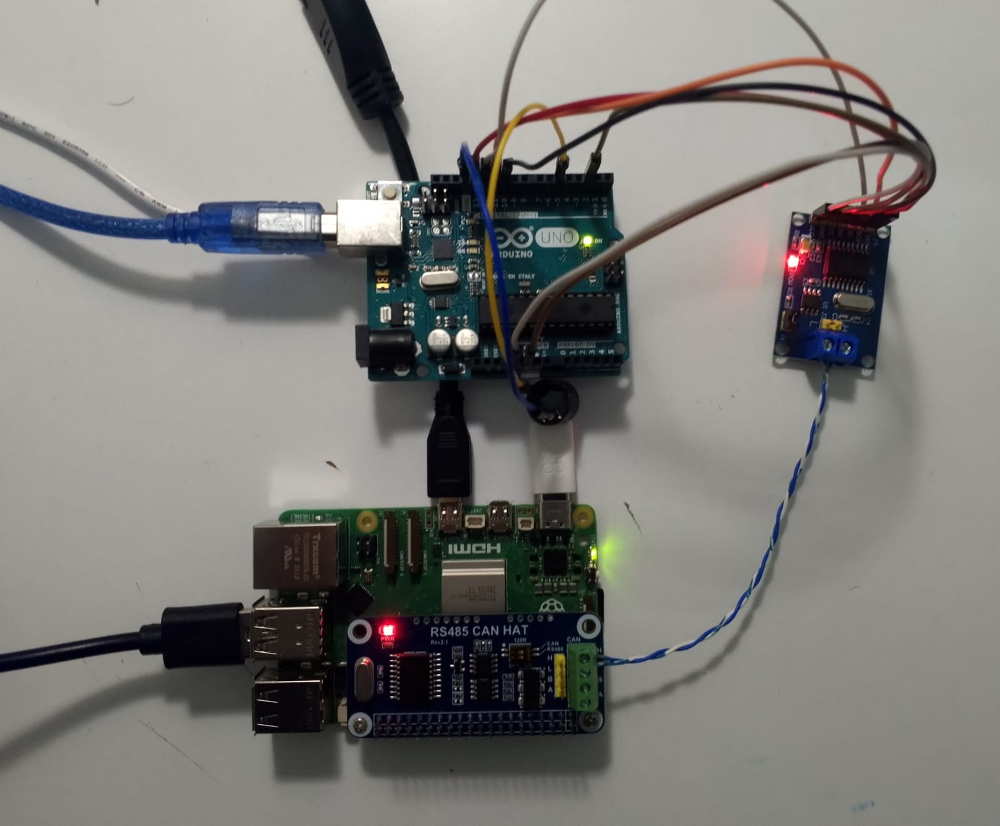
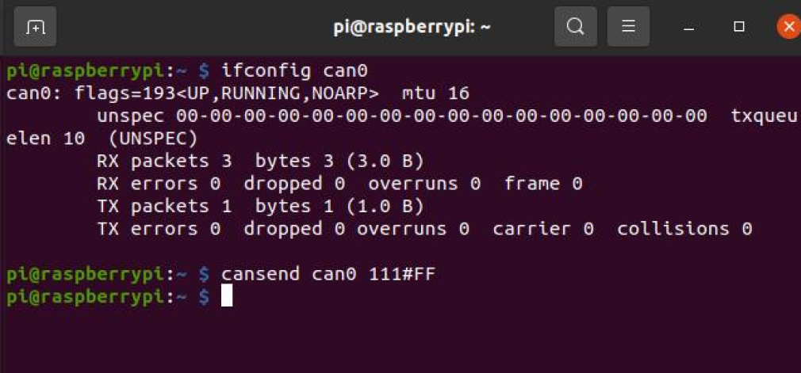

# 🚐🖧 Raspberry Pi - Arduino Uno CANBUS Transceiver

✅ A guide for setting up and configuring a CANBUS communication system using Raspberry Pi and Arduino Uno.

<div align="center">

</div>

## ⚙️ Setup and Configuration

### 1️⃣ Enabling the SPI Interface

```sh
sudo raspi-config
```

- **Interface Options** -> **Enable SPI**
- 

### 2️⃣ Updating `config.txt`

```sh
sudo nano /boot/firmware/config.txt
```

Add the following lines at the end of the file:

```sh
dtparam=spi=on
dtoverlay=mcp2515-can0, oscillator=12000000, interrupt=25, spimaxfrequency=20000000
dtoverlay=spi-bcm2835-overlay
```

### 3️⃣ Restarting the System

```sh
sudo reboot
```

### 4️⃣ Installing Required Tools

```sh
sudo apt-get install can-utils
```

### 5️⃣ Restarting the System Again

```sh
sudo reboot
```

### 6️⃣ Enabling the CANBUS Interface

```sh
sudo ip link set can0 up type can bitrate 500000
```

- `ifconfig`
  

### 7️⃣ Installing the Python CAN Library

```sh
sudo apt update  
sudo apt install python3-can
```

### 8️⃣ Running the Python Code

```sh
python3 raspberry-pi-canbus-transmitter.py
```

<br>

## 🔄 Setting Up Systemd for Auto-Starting CANBUS

### 1️⃣ Creating the `can0.service` File

```sh
sudo nano /etc/systemd/system/can0.service
```

The content should be as follows:

```ini
[Unit]
Description=CAN0 Interface Up
After=network.target

[Service]
Type=oneshot
ExecStart=/sbin/ip link set can0 up type can bitrate 500000
RemainAfterExit=yes

[Install]
WantedBy=multi-user.target
```

### 2️⃣ Loading and Enabling the Systemd Service

```sh
sudo systemctl daemon-reload
sudo systemctl enable can0.service
sudo systemctl start can0.service
```

### 3️⃣ Final Checks and Restarting

```sh
sudo reboot
```

---

### 📜 License

This project is licensed under the MIT License. For more details, see the [LICENSE](LICENSE) file.
